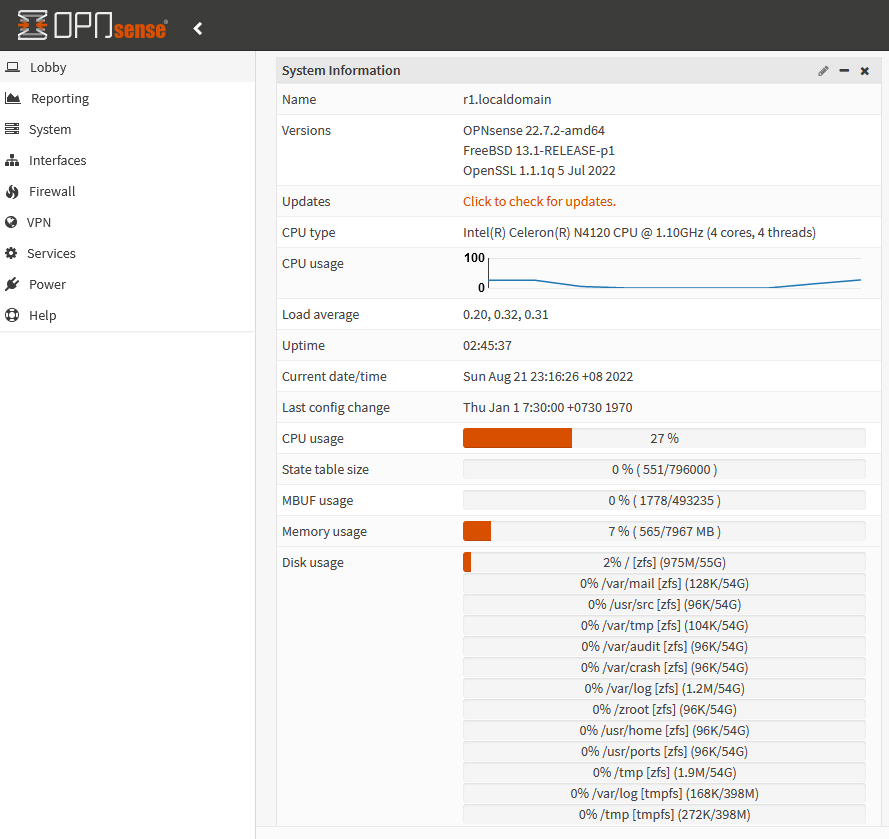
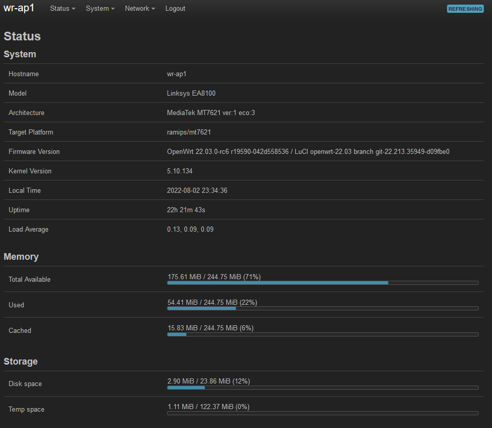

# home-projects
Miscellaneous Home Projects

I like to tinker.

Here you can see screenshots of the "Overview" pages of my home OPNsense and OpenWrt setups for my home network.

There were a couple of objectives in this setup.
* It should be cheap and re-use existing older hardware, i.e. cheap mini-PCs with only a single Realtek gigabit NIC, as well as older generation routers that can be re-flashed easily with OpenWrt.
* It should boot off cheap USB flash drives which means failover is possible with another cheap mini-PC and another USB flash drive as a cold-standby and for testing new OPNsense builds.
* It should support both IPv4 and IPv6 that my ISP provides.
* It should be scalable (to a certain extent).
* It should support failover so that if any part breaks (router / mini-PC / USB flash drive), it's quick and easy to replace them with minimal downtime.
* It should use open-source software and not stock firmware that comes with routers.

Two cheap second-hand routers running OpenWrt are running in "dumb access point" (AP) mode. They do not run DHCP nor DNS servers and function merely as a switch with wireless access points on the 2.4GHz and 5GHz channels. They are connected to each other via 802.11s "mesh" networking using WPA3 SAE encryption. I understand that strictly speaking, it isn't really a mesh as that requires at least three access points. My apartment isn't that large, so two access points are more than enough to cover my entire home. However, if necessary, I can easily add a third dumb AP to my network, which I did for a while, but removed rather quickly as I found it redundant.

Dumb Access Point One does some VLAN tagging as part of the "router on a stick" (ROS) topology, working in tandem with my router below. The "wan" port is connected to my ISP. The "lan1" port is connected to my actual Router (Router is described below), and the remaning three ports are your standard "LAN" ports for the local network ethernet devices.

Dumb Access Point Two (and any further dumb APs if necessary) do not need to do any VLAN tagging.

Now for the real Router setup.

We have the router running on a dedicated mini-PC with OPNsense. As I wanted to re-use a cheap mini-PC that has only a single Ethernet gigabit port, I used the "router on a stick" (ROS) topology. VLAN tagging (working in tandem with Access Point One above) is required to separate traffic between WAN and LAN, since we only have one NIC.

OPNsense is loaded onto a 64GB USB flash drive, which makes it easy to swap it out for another USB flash drive in the unlikely event of failure. This way, it is easy for me to have a "cold standby" which just requires another cheap mini-PC and another cheap USB flash drive, which I currently use for testing new builds of OPNsense before deploying it to production.

Naturally, I could easily have splurged more on a mini-PC with at least two Intel gigabit NICs; however I wanted to show that as a "proof of concept", the ROS topology not only worked well in testing on a cheap mini-PC with a single consumer-grade Realtek gigabit NIC present in such mini-PCs, but was sufficient for a production network easily handling the maximum 500 Mbps throughout that my ISP provides without breaking a sweat.

Services running on my router:
* Freeradius as I use 802.1x authentication for my dumb APs: WPA2 802.1X (CCMP). Every long-term user in my home network gets his/her own username/password, which makes it easy to delete and a new username/password combination created in case these get compromised. There's no need to change the global "WiFi" password and affect every other device connecting wirelessly.
* WireGuard Road Warrior, as a cheap "VPN" when I am connected externally on "open" wireless networks, and also lets me easily configure my home network while outside in a secure manner without using (insecure) backdoors.
* Nginx server as a proof-of-concept (currently hosts nothing).

All devices are running software versions that are "reasonably" recent; no snapshots (too much unnecessary drama there). RCs (release candidates) are fine as long as I'm not an early adopter and the major showstopping issues have already been sorted. As at 31 July 2022, I'm running OpenWrt 22.03.0-rc5 (first released on 7 July 2022) and OPNsense 22.7_4-amd64 (first released on 29 July 2022), and I apply and test updates where available on a weekly basis.

The accompanying screenshots right at the bottom of this document show the hardware specifications of my mini-PC as well as the two routers running in "dumb AP" mode. They are summarized here.

Mini-PC as the real Router:
* Intel(R) Celeron(R) N4120 CPU @ 1.10GHz (4 cores, 4 threads)
* 8 GB RAM
* 64 GB external USB flash drive
* Single Realtek NIC
* Cost: About SGD 250 brand new. Second-hand pre-loved mini-PCs will naturally be cheaper and just as good.

USB flash drives:
* 64GB Sandisk (various models)
* Cost: About SGD 15 - 20 brand new.

Second-hand routers as dumb APs:
* Linksys EA8100 (v1)
* MediaTek MT7621
* 256 MB RAM
* 24 MB storage
* Cost: About SGD 10 - 25 each, second-hand.

Screenshot of the OPNsense Dashboard:

Screenshot of the OPNsense Services:

Screenshot of the Status page of Dumb AP One:

Screenshot of the Status page of Dumb AP Two:

